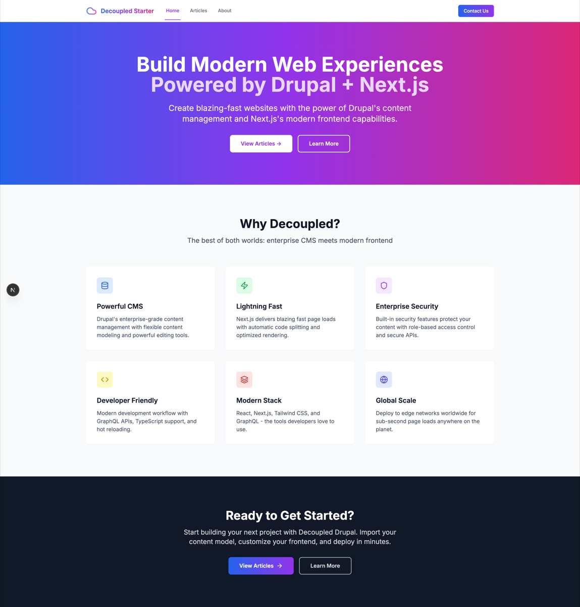

# Decoupled Physical Therapy

A physical therapy clinic website starter template for Decoupled Drupal + Next.js. Built for physical therapy practices, rehabilitation clinics, sports medicine centers, and outpatient therapy offices.



## Features

- **Services** - Showcase treatment specialties with session duration, insurance info, and service categories
- **Therapist Profiles** - Staff bios with credentials, certifications, specialties, education, and patient availability
- **Conditions Treated** - Educational pages for conditions with symptoms, recovery timelines, and categories
- **Static Pages** - About, new patient information, and other content pages
- **Modern Design** - Clean, accessible UI optimized for healthcare content

## Quick Start

### 1. Clone the template

```bash
npx degit nextagencyio/decoupled-physical-therapy my-clinic
cd my-clinic
npm install
```

### 2. Run interactive setup

```bash
npm run setup
```

This interactive script will:
- Authenticate with Decoupled.io (opens browser)
- Create a new Drupal space
- Wait for provisioning (~90 seconds)
- Configure your `.env.local` file
- Import sample content

### 3. Start development

```bash
npm run dev
```

Visit [http://localhost:3000](http://localhost:3000)

---

## Manual Setup

If you prefer to run each step manually:

<details>
<summary>Click to expand manual setup steps</summary>

### Authenticate with Decoupled.io

```bash
npx decoupled-cli@latest auth login
```

### Create a Drupal space

```bash
npx decoupled-cli@latest spaces create "My PT Clinic"
```

Note the space ID returned. Wait ~90 seconds for provisioning.

### Configure environment

```bash
npx decoupled-cli@latest spaces env 1234 --write .env.local
```

### Import content

```bash
npm run setup-content
```

This imports:
- Homepage with hero, stats (8,500+ patients, 20+ years experience, 94% success rate, 10 therapists), and scheduling CTA
- 3 services: Orthopedic Physical Therapy, Sports Rehabilitation, Vestibular Rehabilitation
- 3 therapists: Dr. Kevin Nakamura (Orthopedic), Dr. Amanda Foster (Sports), Dr. Lisa Hoffman (Vestibular)
- 3 conditions: Low Back Pain, ACL Tear Rehabilitation, Frozen Shoulder
- 2 static pages: About Summit Physical Therapy, New Patient Information

</details>

## Content Types

### Service
- **image**: Service image
- **summary**: Brief service description
- **session_duration**: Typical session length (e.g., "45-60 minutes")
- **insurance_accepted**: Whether insurance is accepted (boolean)
- **service_category**: Category taxonomy (Orthopedic, Sports Rehabilitation, Post-Surgical, Neurological, Vestibular, etc.)

### Therapist
- **image**: Portrait photo
- **credentials**: Professional credentials (e.g., "PT, DPT, OCS, FAAOMPT")
- **specialty**: Area of expertise
- **certifications**: List of professional certifications
- **education**: Education background (rich text)
- **accepting_patients**: Whether accepting new patients (boolean)
- **therapist_role**: Role taxonomy (Physical Therapist, PT Assistant, etc.)

### Condition
- **image**: Featured image
- **summary**: Brief condition overview
- **symptoms**: Common symptoms (rich text)
- **recovery_time**: Typical recovery timeline (e.g., "4-8 weeks")
- **condition_category**: Category taxonomy (Back & Spine, Shoulder, Knee, Sports Injury, etc.)

### Homepage
- **hero_title**: Main headline (e.g., "Move Better. Feel Better. Live Better.")
- **hero_subtitle**: Clinic name tagline
- **hero_description**: Introductory paragraph
- **hero_image**: Hero background image
- **stats_items**: Key statistics (patients treated, experience, success rate, team size)
- **featured_items_title**: Section heading for featured services
- **cta_title / cta_description**: Scheduling call-to-action block

### Basic Page
- General-purpose static content pages (About, New Patients, etc.)

## Customization

### Colors & Branding
Edit `tailwind.config.js` to customize colors, fonts, and spacing.

### Content Structure
Modify `data/physical-therapy-content.json` to add or change content types and sample content.

### Components
React components are in `app/components/`. Update them to match your design needs.

## Demo Mode

Demo mode allows you to showcase the application without connecting to a Drupal backend.

### Enable Demo Mode

```bash
NEXT_PUBLIC_DEMO_MODE=true
```

### Removing Demo Mode

1. Delete `lib/demo-mode.ts`
2. Delete `data/mock/` directory
3. Delete `app/components/DemoModeBanner.tsx`
4. Remove `DemoModeBanner` from `app/layout.tsx`
5. Remove demo mode checks from `app/api/graphql/route.ts`

## Deployment

### Vercel (Recommended)
[](https://vercel.com/new/clone?repository-url=https://github.com/nextagencyio/decoupled-physical-therapy)

### Other Platforms
Works with any Node.js hosting platform that supports Next.js.

## Documentation

- [Decoupled.io Docs](https://www.decoupled.io/docs)
- [Next.js Documentation](https://nextjs.org/docs)
- [Drupal GraphQL](https://www.decoupled.io/docs/graphql)

## License

MIT
